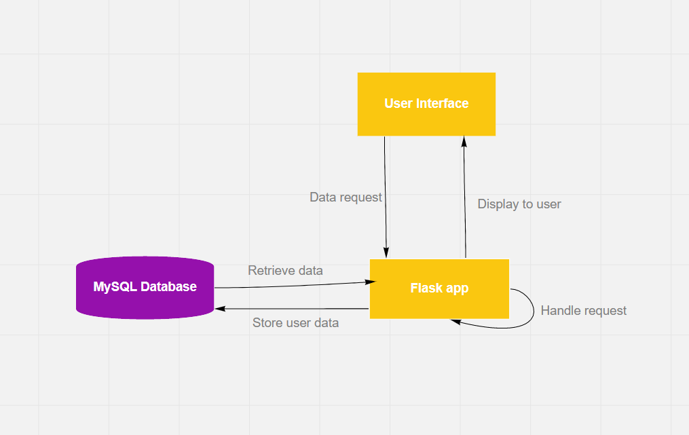
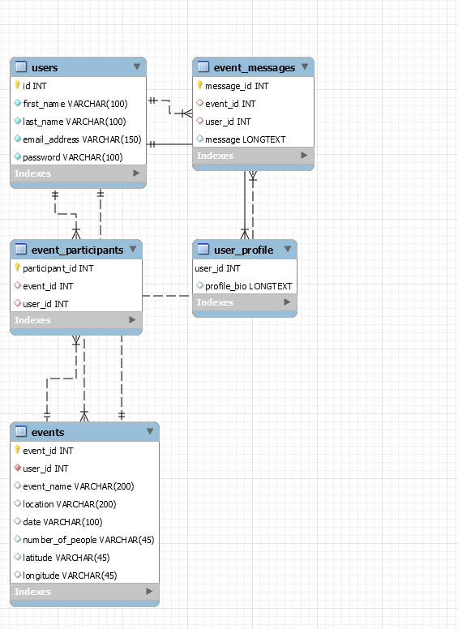
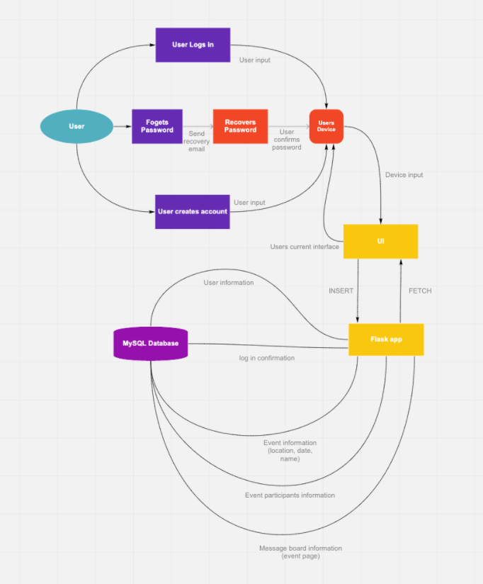
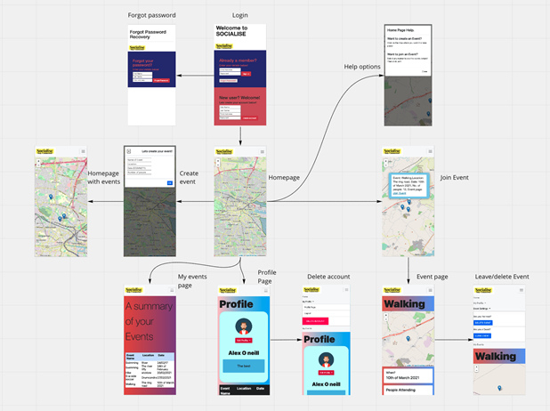
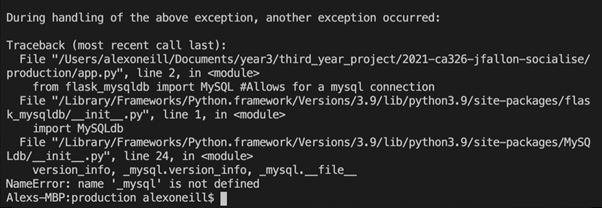

<h3><strong>Socialise Technical Specification</strong></h3>
<h3><strong>&nbsp;</strong></h3>
<h3><strong>1. Introduction</strong></h3>

1.1 Overview

<h3><strong>2. System Architecture</strong></h3>
<h3><strong>3. High Level Design</strong></h3>

3.1 Data Flow Diagram

3.2 Application layout

<ol start="4">
<li><strong> Problems and resolutions</strong></li>
</ol>
<ol start="5">
<li><strong> Installation guide</strong></li>
</ol>
<h3><strong>6. Testing</strong></h3>

3.1 User Testing

3.2 Integration Testing

3.3 Compatibility Testing

<strong>&nbsp;</strong>

&nbsp;

&nbsp;

<ol>
<li>Introduction</li>
</ol>

&nbsp;

1.1 Overview

Socialise is a web application that is used to create events as a host or join existing events as a guest. The user makes use of a map that is the centerpiece of the application. This is where the events are created and joined. The map displays markers with a brief description of the event and the option to join. There is also a &ldquo;help me!&rdquo; button for any users that need help using the map. From the homepage you can access any page through the navigation bar.

Once a user visits the website they will be greeted with a welcome page. This welcome page will allow the user to log in or create an account. There is also forgot password functionality, sending an email to the user. The user will be able to log out of their account from anywhere in the application through the navigation-bar. This will return them to the welcome page.

Users also have a profile page that displays the information about themselves, such as their names and their bio, that they can create themselves. Users can also view their events they have joined/are hosting in a table displayed on the profile page. This table states the name, location and date of the event.

Each event has its own &ldquo;event page&rdquo;. This event page gives a detailed look at the location of the event using a map. It clearly states the date and location of the event. It also displays the participants of the event and a message board that they can discuss the event on.

&nbsp;

<ol start="2">
<li>System Architecture</li>
</ol>

Our architecture consisted of Python&rsquo;s flask web framework and a MySQL database. We decided to use flask because it is a lightweight web framework which allowed us to create a web application easily. It provided us with the necessary tools and libraries to build this app. We chose to use a MySQL database because flask has an extension that allowed us to access a MySQL database without any hassle. This database proved to be very efficient in storing and retrieving the data. We needed to be able to store user&rsquo;s information, messages and event information in the database so that this could then be retrieved whenever a user used our app.

The frontend of our application used JavaScript, HTML, CSS and Bootstrap. Flask communicates with the frontend, sending the data to the database(the backend). It also retrieves the data from the database and sends it over to the frontend where it can then be displayed to the user.

This is an overview of our system architecture:

&nbsp;

Database Schema:

&nbsp;

<ol start="3">
<li>High Level Design</li>
</ol>

&nbsp;

3.1 Data Flow Diagram

&nbsp;

&nbsp;

&nbsp;&nbsp;&nbsp;&nbsp;&nbsp;&nbsp;&nbsp;&nbsp;&nbsp;&nbsp;&nbsp;

3.2 Application layout

&nbsp;

<ol start="4">
<li>Problems and resolutions</li>
</ol>

&nbsp;

<ol>
<li>Sockets</li>
</ol>

Problem:

When we tried installing the latest version of flask-socketio we got a lot of errors.

Solution:

After researching online, we realised that in order for it to work, we needed to install older versions of both python-socketio and flask-socketio. We also had to install flask-cors. This resolved the issue and allowed us to use sockets for communication in the event page.

&nbsp;

<ol>
<li>Git and working remotely</li>
</ol>

Problem:

Lack of experience with version control. This was especially apparent in managing merge requests. We were also very overly cautious of breaking out production code.

Solution:

With more time and research into appropriately using git version control, we were able to work well together. Daily merge requests ensured even though we were working apart, we were always working on the most up to date version of the application. We became more comfortable with implementing more complex features, knowing we would not be damaging the production version.

&nbsp;

&nbsp;

<ol>
<li>Getting database data to display in html elements</li>
</ol>

Problem:

When we made the decision to migrate from vanilla js and vanilla css to bootstrap 5.0, we encountered many problems with displaying the data. The data would be missing when the page would be called.

Solution:

The solution to this problem would be becoming more comfortable with bootstrap 5.0 and understanding how some of its attributes may clash with each other, causing empty elements to be displayed on the website.

&nbsp;

<ol>
<li>Responsive pages</li>
</ol>

Problem:

Using vanilla JS and CSS made it very difficult to make our web app work on multiple devices. An attempt was made to incorporate &ldquo;Flex&rdquo; to our web app, but this seemed to then favour mobile devices over desktops. Another problem would be the dynamic resizing of a window on desktop. The page would never seem to find a comfortable fit and something would always be out of place.

&nbsp;

Solution:

Bootstrap 5.0 grid system using containers and media queries for headings and other text. The container and grid system made our website responsive on all devices and screen sizes. It also made our code cleaner, shorter and more easily read. Media queries meant we could have big heading when we needed, and appropriately sized ones on smaller displays.

&nbsp;

<ol>
<li>Getting website hosted</li>
</ol>

Problem:

In order to allow users to test this app, we needed to host it on DCU&rsquo;s server. We didn&rsquo;t know how this could be done.

&nbsp;

Solution:

We decided to get in touch with people in the IT department in DCU and they helped us set up a flask container on the dcu server. Once this was set up, I cloned our repository and followed our own installation guide that we had made for setting up this project.

&nbsp;&nbsp;&nbsp;&nbsp;&nbsp;&nbsp;&nbsp;&nbsp;&nbsp;&nbsp;&nbsp;

&nbsp;

<ol>
<li>Visibility issue on homepage</li>
</ol>

Problem:

When we undertook our user testing, a frequent problem the users seemed to have was on the homepage. The &ldquo;help me!&rdquo; button was hidden by a side scrolling bar. This also covered the drop down menu on mobile devices in the navigation bar. This led to confusion as these elements were used frequently by first time users as a tutorial for the homepage.

Solution:

The problem lay in the css attributes of the navigation-bar and the leaflet map element. The nav-bar had no set height and was only using the height of the logo nested in the navigation bar as a guide. The map also was using &ldquo;100% height&rdquo;, meaning it would ultimately feed off the screen because of the navigation bar. This was fixed by setting the height of the navigation bar to 15% and the height of the map to 85%. Now, the map and navigation are consistent across all screen sizes and ultimately the side scroller is gone.

&nbsp;

<ol>
<li>Getting database connected</li>
</ol>

Problem:

The database was set up without a problem on a windows machine. When trying to connect to the database on a mac machine, there was a wide variety of errors. This error being the most prevalent:

Solution:

After a long day of trouble shooting it became evident that some variables were not set correctly in .bash_profile file. This meant that the machine was having trouble understanding installed packages. Adding the following lines to the file resolved the problem.

&nbsp;

<ol start="5">
<li>Installation Guide</li>
</ol>

&nbsp;

Please use git clone to download the web app by using command &ldquo;git clone <a href="https://gitlab.computing.dcu.ie/falloj22/2021-ca326-jfallon-socialise.git">https://gitlab.computing.dcu.ie/falloj22/2021-ca326-jfallon-socialise.git</a>&rdquo; in your command promt on windows or terminal on any unix based machine.

&nbsp;

You can also use the web application by visiting socialise.computing.dcu.ie .

&nbsp;

If you are looking to install the system through git, please ensure the following requirements are met:

&nbsp;

Flask 0.12.2

Python 3.9.1

MySQL 8.0.23

Flask-mail

Python-socketio 3.1.2

Flask-socketio 4.3.2

Pyyaml

&nbsp;

&nbsp;

<ol start="6">
<li>Testing</li>
</ol>

&nbsp;

6.1 User Testing

User testing was the most important form of testing we did. This is when an unbiased user base was able to give honest feedback on the decisions we had made up to this point. We based our user testing off our functional specification's use cases. We created a route system, a list of tick the box items for the user to do. We made sure that the user was exposed to all elements of the web application. Once they were put through the test, the user was then asked to fill out a series of detailed questions.

We learned a lot about the application through this, especially areas that we had not realised there was a problem before. We ended up changing some elements in the navigation bar to better suit the user and a slightly adjusted welcome page was highly recommended by most of the testers. Another feature that was recommended was for each event in the my events page would link back to that event page. These were then implemented.

6.2 Integration Testing

As we were both working on different parts of the project at the same time, we were constantly combining code to make sure it worked. This included making sure that the flask app was sending data to the .html files correctly through JSON dumps and ensuring user input was making it all the way to the database through the flask app for example.

This was mainly done through the use of git. We would push and pull to merge requests, replacing old code with new functionality. If at any point something would break we would resort back to a previous commit. This testing was most important as it ensured our production branch was always functional.

&nbsp;&nbsp;&nbsp;&nbsp;&nbsp;&nbsp;&nbsp;&nbsp;&nbsp;&nbsp;&nbsp; 6.3 Compatibility Testing

Since a goal of this project was that the application would work on all devices and screen sizes, we were constantly using google chrome's developers tool to ensure the new functionality works on all types of devices. The &ldquo;responsive feature&rdquo; of the developer tools was the most important metric in these tests. If the desired element was not responsive, it was evident that more work would need to be done.

&nbsp;

References

 1. Flask Mail. Available: https://pythonhosted.org/Flask-Mail/ Accessed: 1st March 2021.

 2. Flask-socketio. Available https://flask-socketio.readthedocs.io/en/latest/ Accessed: 22nd February 2021

 3. Flask-Session. Availablehttps://flask-session.readthedocs.io/en/latest/ Accessed: 25th January 2021

 4. Leaflet. https://leafletjs.com/ Accessed: 1st February 2021

 5. Flask. https://flask.palletsprojects.com/en/1.1.x/ Accessed: 18th January 2021

 6. Login and Registration Project Using Flask and MySQL.https://www.geeksforgeeks.org/login-and-registration-project-using-flask-and-mysql/ Accessed: 25th January 2021

 7.Flask-MySQL. Available: https://flask-mysql.readthedocs.io/en/stable/ Accessed: 18th January 2021

 8. Bootstrap Introduction. Available: https://getbootstrap.com/docs/5.0/getting-started/introduction/ Accessed: 1st March 2021

 9. Flask flashing. Available: https://flask.palletsprojects.com/en/1.1.x/patterns/flashing/ Accessed: 1st February 2021

 10. JavaScript JSON. https://www.w3schools.com/js/js_json.asp Accessed: 11th February 2021

 11. how-to-pass-multiple-parameters-in-a-querystring. Available: https://stackoverflow.com/questions/724526/how-to-pass-multiple-parameters-in-a-querystring Accessed: 11th March 2021

 12. how-do-you-get-a-query-string-on-flask. Available: https://stackoverflow.com/questions/11774265/how-do-you-get-a-query-string-on-flask Accessed: 11th March 2021
