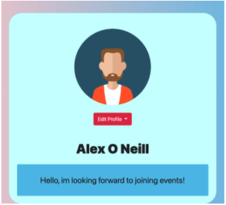

# Socialise User Manual

## 1. Introduction

1.1 Overview

1.2 Disclaimer

## 2. App System

3.1 Layout

3.2 Key Features

## 3. App Features

3.1 Create Account

3.1.1 Email confirmation

3.2 Login

3.2.1 Forget password

3.3 Home Page

3.4 Create Event

3.5 Event Message Board

3.6 Event Settings

3.6.1 Delete Event

3.7 Join Existing Event

5.7.1 Leave Event

3.8 Profile Page

3.8.1 Bio-change

3.8.2 Delete Account

3.9 My-events

3.10 Logout

## 3. Installation Guide

To use this web application, all you have to do is visit https://socialise.computing.dcu.ie/welcome

The user will also have to have their location enbaled, for the map interface to function. The application will not work without this enabled.

### 1. Introduction

1.1 Overview

Socialise is a web application that allows users to create and join existing events,
with a goal of bringing people together.

The events can be created by any user and the details of the events are fully
customizable. This included location, date and time and amount of people the event
is meant for. The entire application is synced with a MySQL database to ensure
consistency across multiple users of the application. If a user creates an application,
all other users will be able to join this event, if that is what they desire.

The application has been designed to be intuitive, but there are relevant help options
offered when needed. They are also not intrusive, so when they are not needed, they
will not be in the way.
The application has a goal of being as good on all devices as possible. Its responsive
nature was a focus throughout the creation and testing of the application. When a
user switches between devices, this will be evident.

1.2 Disclaimer
Socialise is not responsible for any inappropriate names or event information that
may be offensive. Although there will be an effort to stop these from happening.

Any damage done to devices while using Socialise is not Socialise’s liability. The
application was extensively tested throughout development and no harm was done to
any test machine.

### 2. App System

2.1 Layout
The user will start at the welcome screen. They will be able to create an account, log
in or use the forgot password function. Once the user manages to log in they will be
greeted by the map interface. This is the homepage.

The navigation bar will change and adapt to the page that the user is currently on. On
the homepage you have links to my profile, my events and a help function if needed.
On the events page you have events settings and on the profile page you have
profile settings.

The user will be able to view all their events from the my-events page and also on a
more condensed version of the profile page.

The layout of the system will be discussed in great detail below, taking the user
step-by-step through the entire system and any use case they may have.

2.2 Key Features

The main features of socialise is to create and join events. These events can involve
anything from a football match to a swimming lesson. The goal is to get people
involved in more activities then they normally would. The key feature is being a
powerful, single place to get people together and make friends. The simple UI
removes the barriers between the user and the event being organised and taking
place.

The map is a key feature. It archives its intention to display where surrounding events
are in relation to your current location. This means the user is not just reading a long
list of place names they never heard of. This app is ideal for people who may not be
familiar with their surrounding area.

The goal is to ensure events that are organized, take place due to a sufficient amount
of attendees. This only happens if they events are easily accessible, which is a major
feature of socialise.

## 3. App Features

3.1 Create Account

If the user does not have an existing account, they will be offered to make one. They
will be asked to enter their full name for display purposes, email address for
verification and password to keep their account secure. Once all these details have
been entered, the user will then be able to access the account. They will be directed
to the homepage.

3.1.1 Email confirmation

The email that is supplied in the create account form, will be sent a confirmation
email to ensure a secure account.

3.2 Login

As seen in the screenshot above, if the user already has an account with socialise,
they may sign in straight away. They will be asked for their email and their password
that they supplied when creating their account. Once logged in, they will be sent
straight to the homepage of the application.
3.2.1 Forget password
If you have forgotten your password, you can enter your information and a recovery
email will be sent to your email address, which can then be used to gain access to

your account again.

3.3 Home Page

Once logged in, you will be greeted by the centerpiece of the application, the map
interface. The map interface will display all information regarding events. This is not
only a way to view existing events, but also a way of creating them. If there is ever a
problem with remembering how to create or join events, please refer to the “help me!”
item in the navigation bar. On desktop this can be seen on the right above the map,
on mobile please access the navigation bar by clicking the dropdown menu. Below
are what these options look like.

3.4 Create Event

By selecting the desired location on the map, you can create an event. Once the map
is clicked, a form will popup that once filled in, will create your event. This event is
now joinable. Any user of the application will be able to join your event if they wish to.
A marker now appears where the event is. Click “join event” in the marker to access
the event page. All information regarding the event will be displayed here, A more
detailed and focused map will be presented along with the date of the event.

3.5 Event Message Board and participants

Two elements that allow interaction with the event are event participants and the
message board. Event participants shows all usernames that have joined the event.
The message board is a feature that allows all users to ask questions about the
event, and the host or other participants can reply. This simple message board
shows your username and your message once submitted. These messages are tied
to the event in the database and will not be accessible elsewhere.

3.6 Event Settings

In the navigation bar of the event settings, you will be able delete the event and leave
an event.

3.6.1 Delete Event

If you are the host of the event, you may delete the event from this dropdown option
in the nav-bar. Clicking “delete event” will present you with a popup that will warn you
that this action can not be undone.

3.7 Join Existing Event

To join an existing event, click any marker on the map and select “join event”. Once
this button is selected, it will bring you to the event page.

5.7.1 Leave Event

If you wish to leave the event for any reason, please select that “event settings”
dropdown in the navigation bar at the top of the screen.

Then select the leave event option. This will then present you with modal, telling you
what is about to happen. Once you confirm, the event will be removed from your
account.

3.8 Profile Page

The profile page can be accessed from the navigation bar as seen in the screenshot
above. This will then take you to your profile page. You will presented with your
profile card. This card will display your profile picture (once uploaded), your name
and your custom bio. This page also contains an event table, showing information
such as name, location and date of all the events you are either hosting or have
joined.

3.8.1 Bio-change

Using a dropdown form located on the profile card, you will be able to edit your profile
bio. Press submit to save changes to your profile.

3.8.2 Delete Account

If you wish to delete your account, this can be done through the “my profile”
navigation bar item. You will then be asked to confirm, warning that this decision can
not be undone.

3.9 My-events

The my-events page, accessible in the nav-bar from anywhere in the application, will
bring you to a page dedicated to seeing all your events, joined or hosted, in one
place. Name, location and date of the event will be displayed. 

The user will also be able to join their events directly from this page.

3.10 Logout

If you wish to logout of your account, please click the my-profile dropdown and select
logout as seen above. This action will bring you back to the welcome page where you
can log back in when needed.

